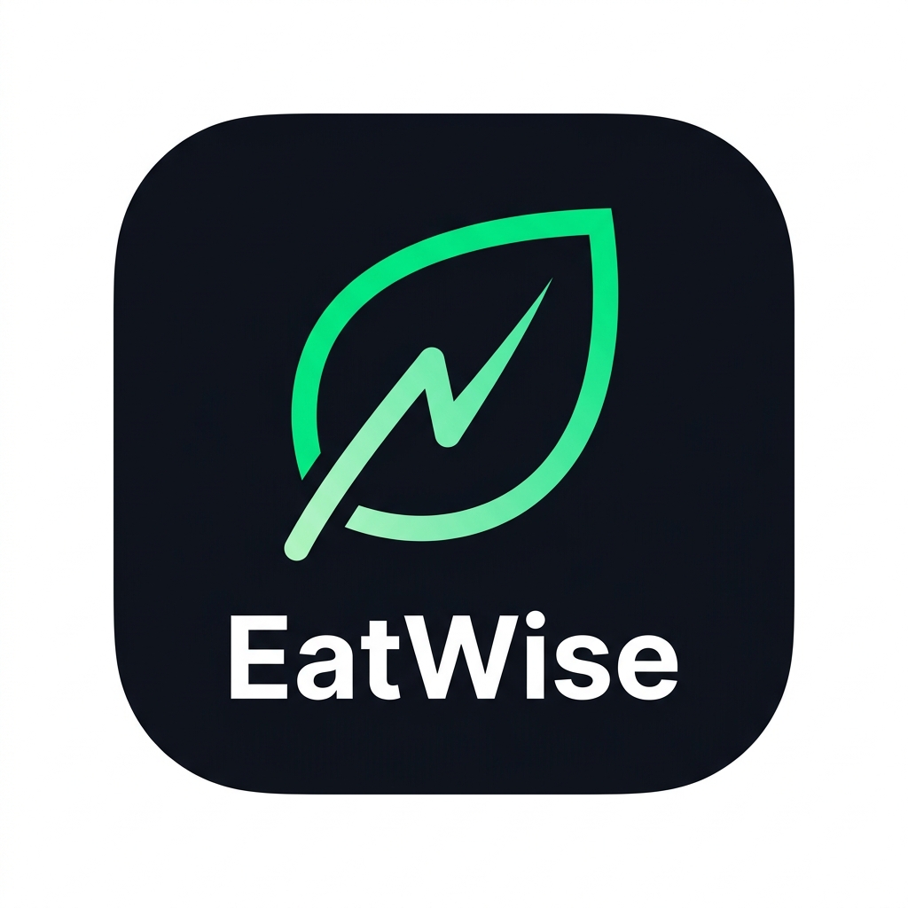

# EatWise — Intelligent Nutrition & Macro Telemetry

<div align="center">
  
  <p><strong>A high-performance, offline-first macro and nutrition tracking application engineered for Philippine cuisine and athletic performance.</strong></p>
</div>

---

## 📌 Overview

**EatWise** is an offline-first fitness and nutrition tracking app built with **Flutter**, **Riverpod**, and **SQLite**. It addresses the common challenge of tracking localized Filipino diets—where mixed dishes (like *Sinigang*, *Adobo*, and *Kare-Kare*) and custom portions are notoriously difficult to log with Western-centric nutrition databases.

EatWise integrates a **4-tier multi-provider AI engine** paired with a **local Philippine Food and Nutrition Research Institute (FNRI) SQLite database**, allowing users to log meals through multimodal photo scans, barcodes, conversational AI, or rapid manual entry—with guaranteed offline uptime.

## ⚡ Key Engineering Highlights

### 1. 4-Tier Resilient AI Fallback Architecture
Public API rate limits (HTTP 429) and upstream model deprecations (HTTP 404) are handled by a multi-provider orchestrator with integrated circuit breakers:

```
┌─────────────────────────────────────────────────────────┐
│                    User Meal Input                      │
└───────────────────────────┬─────────────────────────────┘
                            │
       ┌────────────────────▼────────────────────┐
       │ Tier 1: Google Gemini 2.5 Flash Vision  │ ──► [Success]
       └────────────────────┬────────────────────┘
                            │ (Quota Exceeded / 429 / Error)
       ┌────────────────────▼────────────────────┐
       │ Tier 2: Groq (Llama / Open Source LLM)   │ ──► [Success]
       └────────────────────┬────────────────────┘
                            │ (Unavailable / 429)
       ┌────────────────────▼────────────────────┐
       │ Tier 3: OpenRouter Secondary Fallback   │ ──► [Success]
       └────────────────────┬────────────────────┘
                            │ (Offline / Exhausted)
       ┌────────────────────▼────────────────────┐
       │ Tier 4: Offline Local SQLite Database   │ ──► [Guaranteed Local Match]
       │ (Philippine FNRI Nutrition Dataset)     │
       └─────────────────────────────────────────┘
```

* **Instant Failover**: Detects hard quota limits and model errors immediately without blocking the UI thread with redundant retry delays.
* **Privacy & BYOK**: Supports user-provided API keys stored securely in `FlutterSecureStorage` with zero cloud lock-in.

### 2. Athletic Obsidian Design System
* **Concentric Budget Dial**: Custom-painted canvas showing real-time calorie budget depletion, progress ratios, and dynamic color shifts for surplus/deficit states.
* **Independent Fasting Capsule**: Visual intermittent fasting tracker (16:8, 18:6, custom) linked directly to timer controls.
* **Zero-Latency Theme Switching**: Caches immutable `ThemeData` instances and overrides Flutter's default 200ms frame interpolation loop with `Duration.zero` for instantaneous light/dark toggling.

### 3. Comprehensive Logging Modalities
1. **AI Vision Camera Scan**: Takes food photos, parses complex multi-item dishes into itemized macros, and generates editable portions.
2. **Philippine Barcode Scanner**: Reads EAN-13 barcodes with local offline database lookup and OpenFoodFacts fallback.
3. **Conversational AI Coach**: Natural language chat interface ("I ate 2 eggs and 1 pandesal") that isolates conversation history from background daily telemetry.
4. **Instant Manual Food Entry**: Dedicated floating action button routing directly to quick manual logging with zero network overhead.

### 4. Health & Metabolism Analytics
* **Mifflin-St Jeor Engine**: Calculates basal metabolic rate (BMR) and total daily energy expenditure (TDEE) based on user goal (cut, maintain, bulk).
* **Dynamic Streak Counter**: Computes consecutive active tracking days with morning grace periods.
* **Historical Macro Grid**: Week-over-week calorie charts and monthly calendar views for diet consistency review.

---

## 🛠️ Architecture & Tech Stack

| Layer | Technology | Purpose |
|---|---|---|
| **Framework** | Flutter (Dart 3.x) | Cross-platform mobile client |
| **State Management** | Flutter Riverpod 2.x | Reactive dependency injection & state synchronization |
| **Local Database** | SQLite (`sqflite`) | Local-first food logs, weight records, and FNRI database |
| **Navigation** | `go_router` 14.x | Declarative routing with `StatefulShellRoute` branch persistence |
| **AI Vision** | Google Gemini (`google_generative_ai`) | Multimodal food identification & nutrient estimation |
| **AI Inference** | Groq & OpenRouter APIs | High-speed low-latency text fallback orchestration |
| **Secure Storage** | `flutter_secure_storage` | Keystore/Keyring encrypted API key persistence |
| **Hardware / Sensors**| `camera`, `mobile_scanner` | Live optical camera feed & barcode detection |

---

## 📂 Project Structure

```
lib/
├── app.dart                                # MaterialApp.router, theme configuration
├── main.dart                               # Async bootstrap, database init, ProviderScope
├── core/
│   ├── ai/                                 # AI Fallback Orchestrator, Groq & OpenRouter providers
│   ├── constants/                          # AppColors, typography, layout dimensions
│   ├── database/                           # SQLite database helper, FNRI food catalog
│   ├── router/                             # GoRouter routes & bottom navigation shell
│   ├── storage/                            # Secure storage service for API keys
│   └── theme/                              # Obsidian light & dark themes, mode provider
├── features/
│   ├── chat_log/                           # Conversational AI coach & query parser
│   ├── dashboard/                          # Hub, Athletic Dial, History, Profile & Manual Log
│   │   ├── presentation/
│   │   │   ├── providers/                  # Stats, insights, and macro providers
│   │   │   ├── screens/                    # DashboardScreen, HistoryScreen, ProfileScreen
│   │   │   └── widgets/                    # AthleticHeroDial, WeeklyChart, MonthlyCalendar
│   ├── food_ai/                            # Camera scanner, Barcode HUD, food item cards
│   ├── planner/                            # Daily routines, workout presets, hydration goals
│   └── settings/                           # API keys management, fasting schedule toggles
└── services/                               # Food log services, prompt builders, telemetry
```

---

## 🚀 Getting Started

### Prerequisites
* Flutter SDK (3.22 or newer)
* Android SDK (API 24+) or iOS device
* Android Studio / VS Code with Flutter extension

### Installation

1. **Clone the repository:**
   ```bash
   git clone https://github.com/YajiHub/EatWise.git
   cd EatWise
   ```

2. **Install dependencies:**
   ```bash
   flutter pub get
   ```

3. **Configure Environment:**
   Copy the example environment file:
   ```bash
   cp .env.example .env
   ```
   Populate your keys (optional—app functions offline using local database and supports in-app BYOK key configuration):
   ```ini
   GEMINI_API_KEY=your_gemini_api_key_here
   GROQ_API_KEY=your_groq_api_key_here
   OPENROUTER_API_KEY=your_openrouter_api_key_here
   ```

4. **Run the Application:**
   ```bash
   flutter run --dart-define-from-file=.env
   ```

---

## 📦 Building for Production

### Android Release APK
Generate a standalone release APK signed for distribution:
```bash
flutter build apk --release --dart-define-from-file=.env
```
The compiled APK will be located at:
```
build/app/outputs/flutter-apk/app-release.apk
```

---

## 🧪 Testing & Code Quality

Run automated unit and widget test suites:
```bash
# Execute test suite
flutter test

# Run static analysis
flutter analyze
```

---
